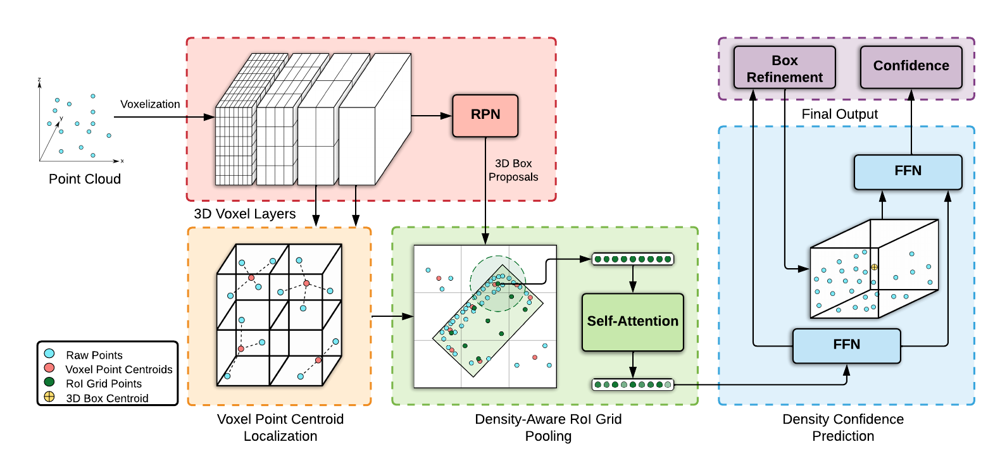

# PDV
PDV is LiDAR 3D object detection method. This repository is based off [`[OpenPCDet]`](https://github.com/open-mmlab/OpenPCDet) and modified to support a alternative personal dataset.

**Point Density-Aware Voxels for LiDAR 3D Object Detection**\
Jordan S. K. Hu, Tianshu Kuai, Steven L. Waslander\
**[[Paper]](https://arxiv.org/abs/2203.05662)**

## Changelog
[2022-03-07] `PDV` v0.1.0 is released.

[2022-06-21] `PDV` based on personal wanji dataset is released.
